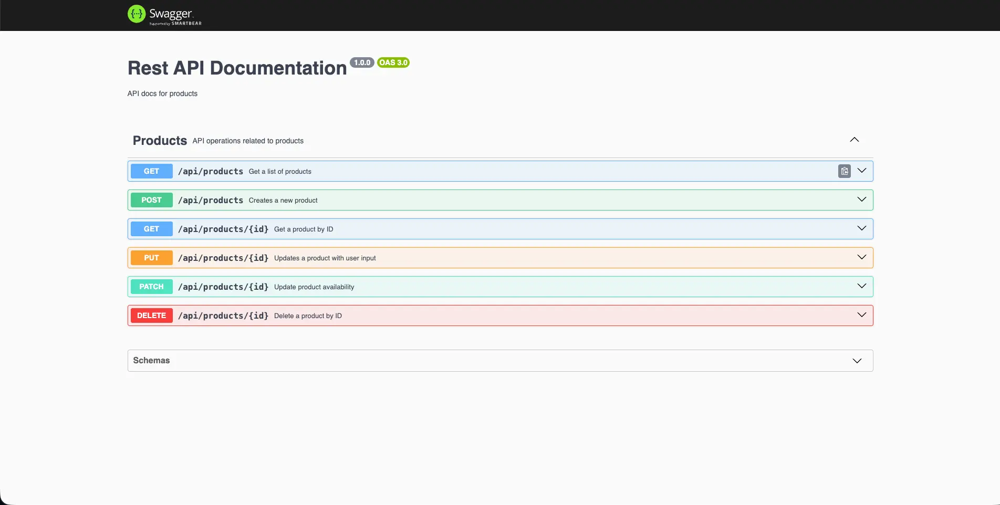
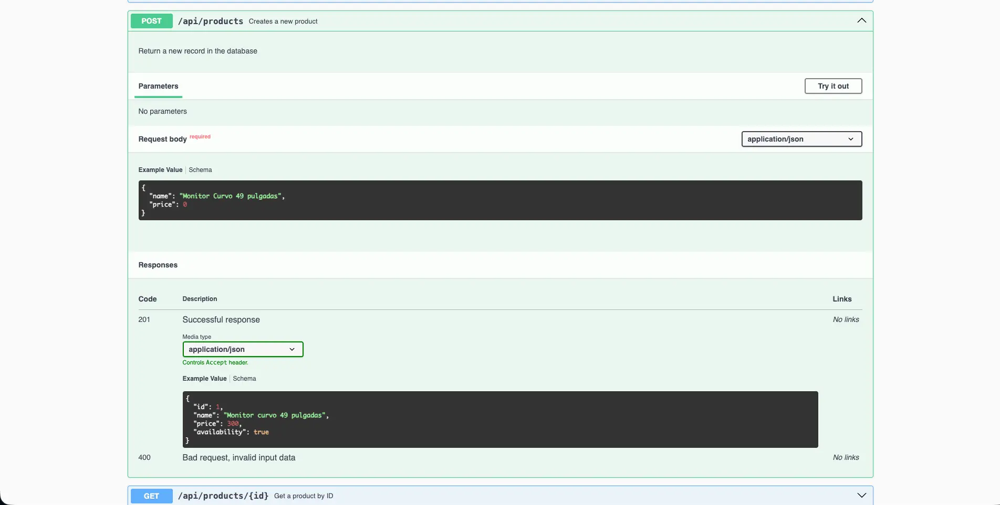
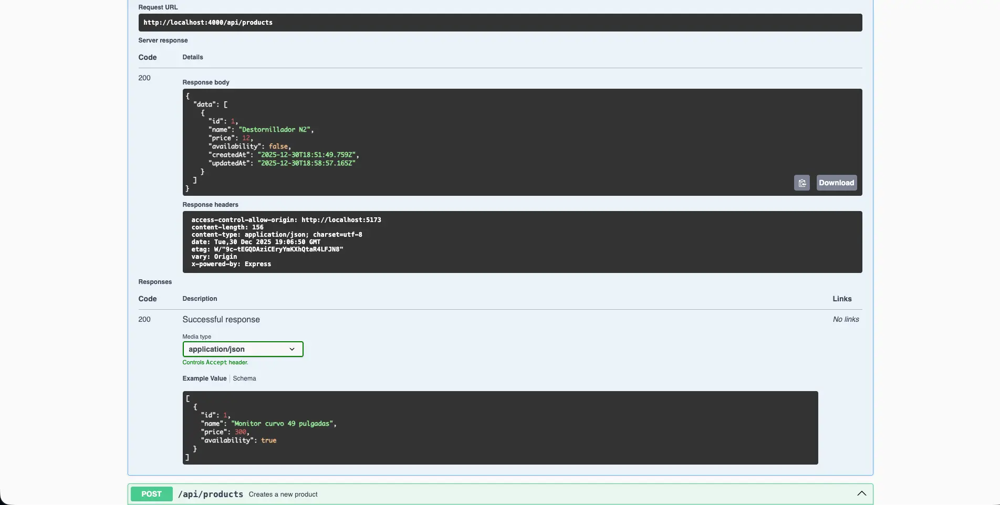
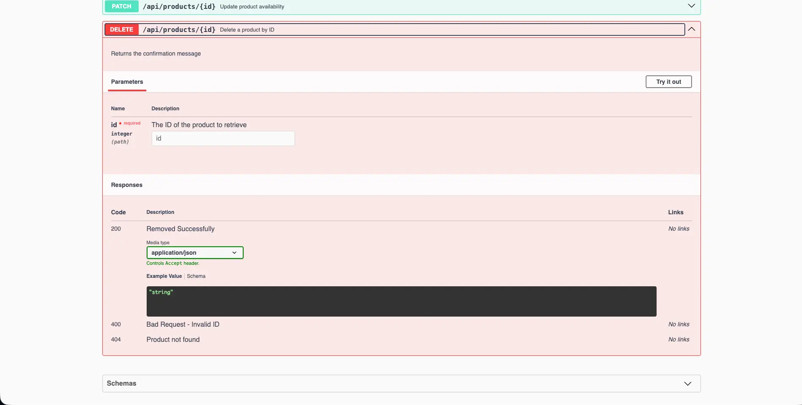

<table width="100%" align="center">
  <tr>
    <td align="center" valign="middle">
      <h1>🛠️ REST API - Administrador de Productos</h1>
      
<b>Backend con TypeScript, Testing de Integración y Documentación Viva</b>

      

      
Node.js | Express | TypeScript | Sequelize (PostgreSQL) | Jest | Swagger

    </td>
  </tr>
</table>

<table>
  <tr>
    <td width="50%">
      

        
      

    </td>
    <td width="50%">
      

        
      

    </td>
  </tr>
  <tr>
    <td width="50%">
      

        
      

    </td>
    <td width="50%">
      

        
      

    </td>
  </tr>
</table>

## Visión General

Este repositorio aloja la lógica de negocio y persistencia de datos del sistema *Administrador de Productos*.

El backend fue construido no solo para servir datos, sino para garantizar su integridad. Se implementa una arquitectura por capas (**Router -> Middleware -> Handler -> Model**) asegurada por tipos estáticos y tests automatizados.

---

## Stack Tecnológico: Implementación en Código

A continuación se detalla dónde y cómo se utiliza cada tecnología dentro de la estructura del proyecto:

| Tecnología | Dónde y Por qué se usa en este código |
| :--- | :--- |
| **TypeScript** | Utilizado para definir la clase `Product` extendiendo de `Model`. Gracias a los decoradores `@Column` y `@Table`, TypeScript infiere los tipos de datos, impidiendo que, por ejemplo, intente guardar un *string* en el campo `price` dentro de los handlers. |
| **Sequelize (ORM)** | En lugar de escribir SQL manual (`INSERT INTO...`), utilizo métodos del ORM como `Product.create(req.body)` y `Product.findByPk(id)`. Esto se configura en `src/config/db.ts`, donde la función `addModels` escanea e inyecta los esquemas en la conexión a PostgreSQL. |
| **Express & Router** | No uso el router solo para rutas. En el archivo `router.ts` implemento cadenas de ejecución: primero valido (`check('name').notEmpty()`), luego verifico errores (`handleInputErrors`) y finalmente ejecuto el controlador (`createProduct`). Esto mantiene los controladores limpios de lógica de validación. |
| **Jest + Supertest** | Utilizo `supertest` para envolver la instancia de `server`. En el test `POST /api/products`, simulo el envío de un body vacío `{}` para asegurar que mi API responda con **Status 400** y el array de errores esperado, garantizando que las validaciones funcionan sin levantar el servidor manualmente. |
| **Swagger (OpenAPI)** | Configurado para leer los JSDoc ubicados en `router.ts`. Al definir `@swagger` sobre la ruta `/api/products`, la librería genera automáticamente el JSON que renderiza la interfaz visual en `/docs`, permitiendo probar la API sin necesidad de Postman. |

---

## Desafíos Técnicos Resueltos

### 1. Implementación de Testing Automatizado
Tuve que hacer compatible Jest con TypeScript, permitiendo correr tests unitarios o de integración para validar tu API sin tener que probar manualmente cada endpoint.

### 2. Configuración de Entorno de Desarrollo Tipado (TypeScript)
He definido las reglas del compilador (como el outDir para producción, el rootDir en `./src`, y y reglas estrictas como `strict: true`). Esto asegura que el servidor (Express) y la base de datos (Sequelize) tengan un tipado estático fuerte, previniendo errores comunes en tiempo de ejecución.

### 3. Arquitectura Modular y Escalable
Esta estructura hace que tu código sea mantenible y escalable, a diferencia de un "spaghetti code" donde todo está mezclado.
* **Entry Point:** Definido en index.ts junto a server.ts para levantar el servidor.
* **Modelo:** La estructura del producto de la base de datos.
* **Rutas/Controladores:** Para manejar las peticiones HTTP de forma aislada.